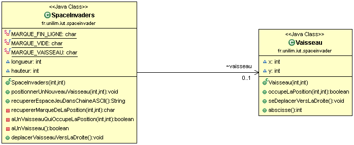
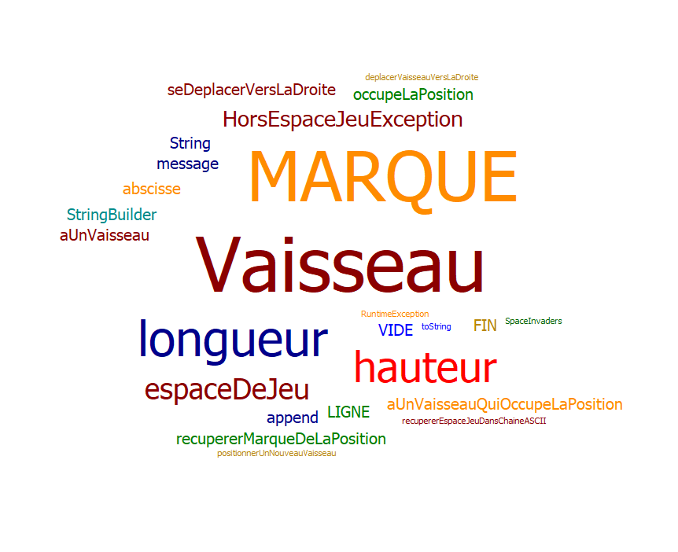

# SpaceInvader
# 16/04/2020
Crétion du projet SpaceInvader

#Semaine n°1 : du 20 au 24 avril
Sprints et fonctionnalités réalisées
Fonctionnalité n°1 : Déplacer un vaisseau dans l'espace de jeu (fini)

    Story n°1 : Créer un espace de jeu
    Un espace de jeu est créé aux dimensions données (2D) Cet espace de jeu est vide

    Story n°2 : Positionner un nouveau vaisseau dans l’espace de jeu
    Un nouveau vaisseau est créé Le vaisseau est positionné aux coordonnées transmises Si un nouveau vaisseau essaye d’être positionné en dehors  	des limites de l’espace jeu, alors une exception devra être levée. Contraintes : La position souhaitée est transmise par ses coordonnées x et 	y. Le coin supérieur gauche de l’espace jeu (point en haut à gauche) a pour coordonnées (0,0) La taille du vaisseau est réduite pour l'instant 	à son minimum (1 seul point)

    Story n°3 : Déplacer le vaisseau vers la droite dans l'espace de jeu
    Le vaisseau se déplace d'un pas vers la droite Si le vaisseau se trouve sur la bordure droite de l'espace de jeu, le vaisseau doit rester immobile (aucun déplacement, aucune exception levée : le vaisseau reste juste à sa position actuelle).

    Story n°4 : Déplacer le vaisseau vers la gauche dans l'espace de jeu
    Le vaisseau se déplace d'un pas vers la gauche Si le vaisseau se trouve sur la bordure gauche de l'espace de jeu, le vaisseau doit rester immobile (aucun déplacement, aucune exception levée : le vaisseau reste juste à sa position actuelle).

Fonctionnalité en cours d’implémentation :

Aucune
#Diagramme de classes

#Nuage de mots du projet spaceinvaders (séance n°1)

Difficultés rencontrées

Aucune

#Semaine n°2 : du 04 au 08 mai

Fonctionnalité n°2 : Dimensionner le vaiseau (en cours)

Etape n°1	: Le positionnement du vaiseau à bien était implémenté.

Etape 2 : Implémentation en cours de fonctionalité qui fait en sorte qu'il soit impossible de positionner un nouveau vaisseau qui déborde de l'espace de jeu 

#Diagramme :
Pas de diagrame car casiement aucune avancé

#Nuage de mots 
même chose

Difficultés rencontré :
30-45 minutes de perdu a trouver estDansEspaceJeu et 20 minutes de perdu pour refaire le README du a un problème lors d'un push.
Du coup pour pallier a ca je fais le README sur eclipse et je commit/push après.

# Semaines n°3-4 : 11 au 22 mai

Implémentation de la fonctionnalité permettant de faire en sorte qu'il soit impossible de positionner un nouveau vaisseau qui déborde de l'espace de jeu 

#Diagramme de classes

#Nuage de mots du projet spaceinvaderq ( séance n°3)

